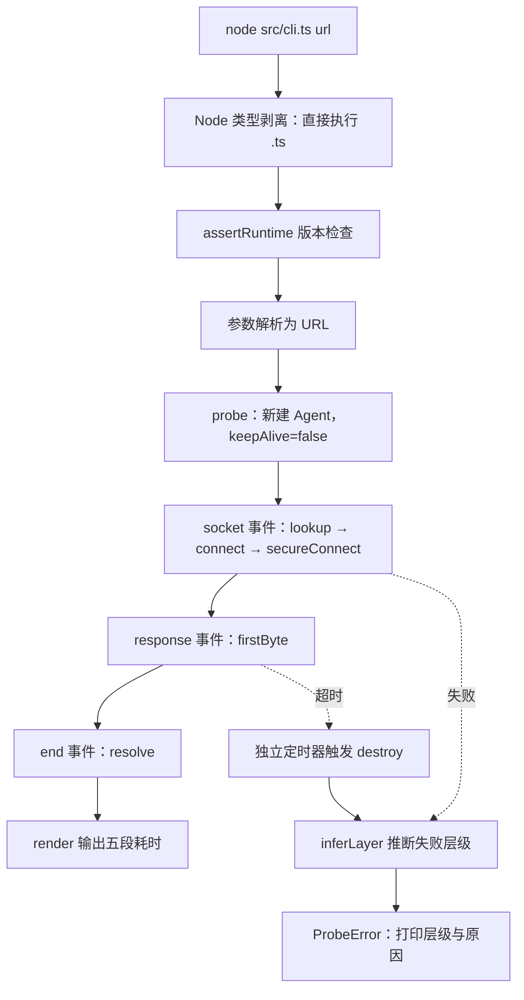

# issue-01-tech-stack 实现记录

| 项 | 值 |
| --- | --- |
| Issue | [#1 [design] 确定第一阶段语言与构建路线](https://github.com/Chengyunlai/netlens/issues/1) |
| Example | [`examples/issue-01-tech-stack/`](../../examples/issue-01-tech-stack/README.md) |
| 断点 | [`breakpoints.md`](../../examples/issue-01-tech-stack/breakpoints.md)（7 个） |
| 实现提交（C1） | `a9dba47` |
| 记录提交（C2） | 本次提交 |
| 状态 | 已完成，待评审 |

## 目标与范围

**目标**：在写第一行业务代码之前，把语言与构建路线定下来并落地，使"克隆后无需构建即可运行"这句承诺成立。

**范围内**：配置文件、一个最小可运行入口、记录与索引。
**范围外**：诊断规则、冷热对比、整页连接图、协议协商探测、终端渲染设计。

## 已验证的行为

一条可复现的输入与输出（Node 22.22.2）：

```bash
$ node src/cli.ts example.com

https://example.com/

分层耗时（冷请求，首次连接）
  DNS 解析    12.9 ms
  TCP 握手   176.2 ms
  TLS 握手   180.4 ms
  首字节     172.4 ms
  响应传输     1.2 ms
  ───────────────────
  合计       543.1 ms

连接信息
  远端      104.20.23.154:443 (IPv4)
  请求协议  http/1.1
  TLS       TLSv1.3
  状态码    200
  响应体    318 字节
```

## 关键路径



## 验证矩阵（全部实测）

| 验收标准 | 命令 | 真实结果 |
| --- | --- | --- |
| 无需构建即可运行 | `node src/cli.ts example.com` | 直接输出，前后无 install / build |
| 发布产物可用 | `npm run build` 后 `node dist/cli.js example.com` | 产物可执行；`./probe.ts` 已重写为 `./probe.js` |
| 零运行时依赖 | 检查 `package.json` | `dependencies` 字段不存在 |
| 版本过低有提示 | 临时把下限改为 99 | 输出两行可读提示，退出码 1 |
| 失败定位到层（DNS） | 不存在的域名 | `请求在 DNS 阶段失败：getaddrinfo ENOTFOUND ...` |
| 失败定位到层（TCP） | `https://127.0.0.1:1` | `layer=tcp`，`connect ECONNREFUSED 127.0.0.1:1` |
| 不会永久挂起 | `https://example.com:9` | 15.096 秒返回 `探测在 15000 ms 内没有完成` |

## 实现过程中发现并修复的两个缺陷

这两个都是**先写错、再被真实输出暴露出来**的，不是提前想到的：

| 缺陷 | 现象 | 根因 | 修复 |
| --- | --- | --- | --- |
| 远端端口显示为 0 | 输出 `104.20.23.154:0` | `lookup` 触发时连接尚未建立，`remotePort` 是 `undefined` | 移到 `connect` 回调读取 |
| 超时保护完全失效 | 3 秒上限的探测实际等了 75268 ms，错误信息还是空的 | `request.setTimeout()` 只在 socket **已连接之后**才生效 | 换成独立定时器 + `request.destroy()` |

## 关键断点（摘要）

完整版见 [`breakpoints.md`](../../examples/issue-01-tech-stack/breakpoints.md)。最容易踩的两个：

1. `socket.once('lookup')` 里读 `remotePort` 得到 `undefined` —— 必须在 `connect` 里读。
2. `request.setTimeout()` 保护不了建连阶段 —— SYN 被丢弃时内核会重试到 75 秒。

## 与 issue 描述的偏差

| issue 里写的 | 实际实现 | 原因 |
| --- | --- | --- |
| devDependency 只有一个 `typescript` | `typescript` + `@types/node` | 实测：缺 `@types/node` 或未声明 `types: ["node"]` 时，`console` / `process` 报 `TS2584` |
| 只提到 `src/cli.ts` | 拆成 `types.ts` / `probe.ts` / `cli.ts` | "观测与判断分离"是项目既定原则；类型单独成文件也直接体现选 TS 的收益 |
| 未提 example 的类型检查 | 增加 `tsconfig.typecheck.json` | 避免 example 随时间腐烂：它也是被类型检查的对象 |

## 遗留与后续

- `main.ts` 的输出是临时的，正式渲染层做好后整体替换。
- `probe()` 目前只测冷路径（`keepAlive: false`）。热路径与连接复用判定属于后续 issue。
- 输出中的「请求协议」是**本次请求实际使用**的协议，不代表服务端支持的协议集合。
- 测试框架仍未引入：目前没有值得断言的纯逻辑，硬上会成为负担。

## 关联

- Example：[`examples/issue-01-tech-stack/`](../../examples/issue-01-tech-stack/README.md)
- 断点：[`breakpoints.md`](../../examples/issue-01-tech-stack/breakpoints.md)
- 索引：[`examples/README.md`](../../examples/README.md)
- 实现提交：`a9dba47`
